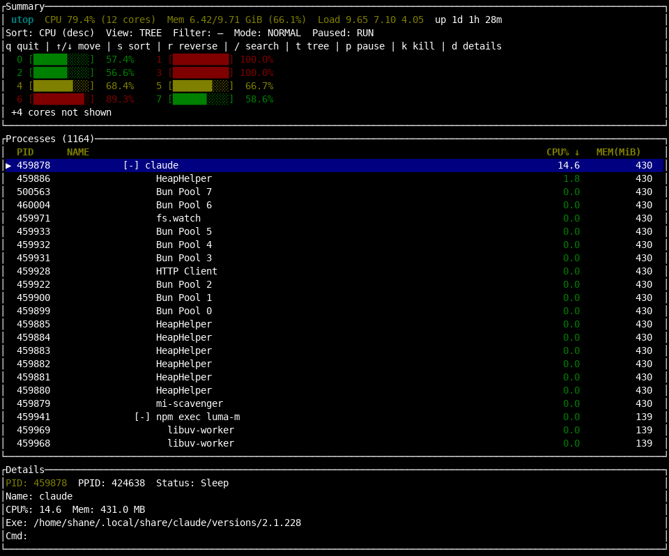

# utop

一个用 Rust 编写的轻量级终端进程监视器，基于 ratatui 和 sysinfo，灵感来自 htop。

- **轻量**：仅依赖 crossterm、ratatui、sysinfo 三个 crate，无任何系统级依赖
- **直观**：逐核 CPU 仪表按负载着色，进程详情一眼可读
- **教学友好**：模块划分清晰，渲染、采集、状态、模型各司其职，适合作为 ratatui + TUI 入门参考

## 截图



## 功能

- 逐核 CPU 仪表，按负载着色（绿 / 黄 / 红）
- 概览面板显示负载均值与运行时长
- 进程表可按 CPU、内存、PID、名称排序，支持升序 / 降序切换
- 增量搜索过滤（匹配进程名或 PID）
- 树状视图，子树可折叠
- 杀进程带二次确认与信号选择（SIGTERM / SIGKILL）
- 进程详情面板（状态、PPID、可执行文件、命令行）
- 暂停 / 恢复刷新，刷新间隔可调
- 鼠标滚轮滚动
- 命令行参数：初始排序、过滤、刷新间隔、视图模式

## 构建与运行

```sh
cargo build --release
./target/release/utop
```

或者直接：

```sh
cargo run --release
```

## 用法

```
utop [选项]

选项：
  -h, --help           打印帮助并退出
  -s, --sort <KEY>     初始排序键：cpu | mem | pid | name [默认：cpu]
  -a, --asc            以升序启动 [默认：降序]
  -d, --delay <MS>     刷新间隔（毫秒），范围 100..=5000 [默认：500]
  -f, --filter <STR>   初始进程过滤（匹配名称或 PID）
  -t, --tree           以树状视图启动
  -V, --version        打印版本并退出
```

## 按键

| 按键 | 动作 |
|------|------|
| q / Ctrl+C | 退出 |
| 上/下、PgUp/PgDn、Home/End、鼠标滚轮 | 导航 |
| s | 切换排序键（CPU / 内存 / PID / 名称） |
| r | 切换升序 / 降序 |
| / | 搜索进程（回车确认，Esc 清除） |
| Esc | 清除过滤 |
| t | 切换树状视图 |
| 空格 | 折叠 / 展开子树（树状视图） |
| p | 暂停 / 恢复刷新 |
| F5 | 强制刷新 |
| k | 杀死选中进程（y = SIGTERM，K = SIGKILL，Esc = 取消） |
| d / 回车 | 切换进程详情 |
| - / + | 减小 / 增大刷新间隔（步长 100 毫秒） |

注：过滤时会临时把树状视图拍平为列表，因为残缺的树比普通列表更难读。

## 模块结构

| 模块 | 职责 |
|------|------|
| `src/main.rs` | 入口与事件循环 |
| `src/app.rs` | 应用状态与输入模式 |
| `src/model.rs` | 进程行模型、排序、过滤与树构建（纯逻辑） |
| `src/collect.rs` | sysinfo 快照（唯一碰 sysinfo 的模块） |
| `src/ui.rs` | ratatui 渲染 |
| `src/cli.rs` | 命令行参数解析（纯解析器） |

## 许可证

MIT OR Apache-2.0
