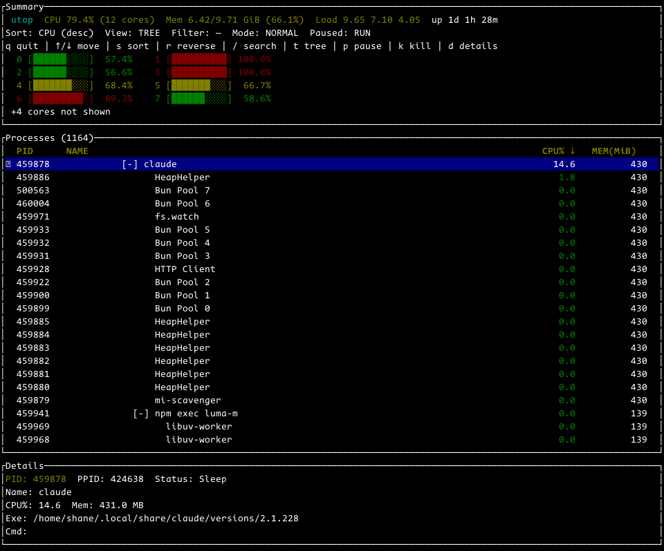

**English** | [中文](#chinese)

<a id="top"></a>

# utop

A lightweight terminal process monitor written in Rust, based on ratatui and sysinfo, inspired by htop.

- **Lightweight**: depends only on the crossterm, ratatui and sysinfo crates, with no system-level dependencies
- **Intuitive**: per-core CPU meters colored by load, process details readable at a glance
- **Example project**: a structurally complete Rust TUI tool — model, state, collection and rendering each have their own role — suitable as a starting point for reading and secondary development

## Screenshots



## Features

- Per-core CPU meters, colored by load (green / yellow / red)
- Overview panel showing load averages and uptime
- Process table sortable by CPU, memory, PID and name, with ascending / descending toggle
- Incremental search filtering (matches process name or PID)
- Tree view with collapsible subtrees
- Kill process with a second confirmation and signal selection (SIGTERM / SIGKILL)
- Process details panel (state, PPID, executable, command line)
- Pause / resume refresh, adjustable refresh interval
- Mouse wheel scrolling
- Command-line options: initial sort, filter, refresh interval, view mode

## Build & Run

```sh
cargo build --release
./target/release/utop
```

Or simply:

```sh
cargo run --release
```

## Usage

```
utop [选项]

选项：
  -h, --help           打印帮助并退出
  -s, --sort <KEY>     初始排序键：cpu | mem | pid | name [默认：cpu]
  -a, --asc            以升序启动 [默认：降序]
  -d, --delay <MS>     刷新间隔（毫秒），范围 100..=5000 [默认：500]
  -f, --filter <STR>   初始进程过滤（匹配名称或 PID）
  -t, --tree           以树状视图启动
  -V, --version        打印版本并退出
```

## Keybindings

| Key | Action |
|------|------|
| q / Ctrl+C | Quit |
| Up/Down, PgUp/PgDn, Home/End, mouse wheel | Navigate |
| s | Cycle sort key (CPU / memory / PID / name) |
| r | Toggle ascending / descending |
| / | Search processes (Enter to confirm, Esc to clear) |
| Esc | Clear filter |
| t | Toggle tree view |
| Space | Collapse / expand subtree (tree view) |
| p | Pause / resume refresh |
| F5 | Force refresh |
| k | Kill the selected process (y = SIGTERM, K = SIGKILL, Esc = cancel) |
| d / Enter | Toggle process details |
| - / + | Decrease / increase the refresh interval (step 100 ms) |

Note: when filtering, the tree view is temporarily flattened into a list, because a broken tree is harder to read than a plain list.

## Module Structure

| Module | Responsibility |
|------|------|
| `src/main.rs` | Thin binary entry point |
| `src/lib.rs` | Library crate assembly and module map |
| `src/run.rs` | Event loop (the only non-pure shell, owns the terminal) |
| `src/app.rs` | Application state and input modes (pure logic) |
| `src/model.rs` | Process row model, sorting, filtering and tree building (pure logic) |
| `src/collect.rs` | sysinfo snapshots (the only module that touches sysinfo) |
| `src/ui.rs` | ratatui rendering (pure rendering, reads only the snapshot in App) |
| `src/cli.rs` | Command-line argument parsing (pure parser) |

The layering is strictly acyclic: `model` ← `cli` ← `app` ← {`collect`, `ui`} ← `run`. Everything except `run` and `collect` is pure logic, so unit tests need no real system.

## Development

```sh
cargo fmt          # 格式化
cargo clippy       # 静态检查（CI 以 -D warnings 门禁）
cargo test         # 单元测试 + 集成测试
```

## License

Dual-licensed under [MIT](./LICENSE-MIT) or [Apache-2.0](./LICENSE-APACHE), and the user may choose either one.

---

<a id="chinese"></a>
[English](#top) | **中文**

# utop

一个用 Rust 编写的轻量级终端进程监视器，基于 ratatui 和 sysinfo，灵感来自 htop。

- **轻量**：仅依赖 crossterm、ratatui、sysinfo 三个 crate，无任何系统级依赖
- **直观**：逐核 CPU 仪表按负载着色，进程详情一眼可读
- **示例项目**：一个结构完整的 Rust TUI 工具——模型、状态、采集、渲染各司其职，适合作为阅读和二次开发的起点

## 截图


## 功能

- 逐核 CPU 仪表，按负载着色（绿 / 黄 / 红）
- 概览面板显示负载均值与运行时长
- 进程表可按 CPU、内存、PID、名称排序，支持升序 / 降序切换
- 增量搜索过滤（匹配进程名或 PID）
- 树状视图，子树可折叠
- 杀进程带二次确认与信号选择（SIGTERM / SIGKILL）
- 进程详情面板（状态、PPID、可执行文件、命令行）
- 暂停 / 恢复刷新，刷新间隔可调
- 鼠标滚轮滚动
- 命令行参数：初始排序、过滤、刷新间隔、视图模式

## 构建与运行

```sh
cargo build --release
./target/release/utop
```

或者直接：

```sh
cargo run --release
```

## 用法

```
utop [选项]

选项：
  -h, --help           打印帮助并退出
  -s, --sort <KEY>     初始排序键：cpu | mem | pid | name [默认：cpu]
  -a, --asc            以升序启动 [默认：降序]
  -d, --delay <MS>     刷新间隔（毫秒），范围 100..=5000 [默认：500]
  -f, --filter <STR>   初始进程过滤（匹配名称或 PID）
  -t, --tree           以树状视图启动
  -V, --version        打印版本并退出
```

## 按键

| 按键 | 动作 |
|------|------|
| q / Ctrl+C | 退出 |
| 上/下、PgUp/PgDn、Home/End、鼠标滚轮 | 导航 |
| s | 切换排序键（CPU / 内存 / PID / 名称） |
| r | 切换升序 / 降序 |
| / | 搜索进程（回车确认，Esc 清除） |
| Esc | 清除过滤 |
| t | 切换树状视图 |
| 空格 | 折叠 / 展开子树（树状视图） |
| p | 暂停 / 恢复刷新 |
| F5 | 强制刷新 |
| k | 杀死选中进程（y = SIGTERM，K = SIGKILL，Esc = 取消） |
| d / 回车 | 切换进程详情 |
| - / + | 减小 / 增大刷新间隔（步长 100 毫秒） |

注：过滤时会临时把树状视图拍平为列表，因为残缺的树比普通列表更难读。

## 模块结构

| 模块 | 职责 |
|------|------|
| `src/main.rs` | 薄二进制入口 |
| `src/lib.rs` | 库 crate 装配与模块地图 |
| `src/run.rs` | 事件循环（唯一的非纯外壳，持有终端） |
| `src/app.rs` | 应用状态与输入模式（纯逻辑） |
| `src/model.rs` | 进程行模型、排序、过滤与树构建（纯逻辑） |
| `src/collect.rs` | sysinfo 快照（唯一碰 sysinfo 的模块） |
| `src/ui.rs` | ratatui 渲染（纯渲染，只读 App 中的快照） |
| `src/cli.rs` | 命令行参数解析（纯解析器） |

分层严格无环：`model` ← `cli` ← `app` ← {`collect`, `ui`} ← `run`。除 `run` 与 `collect` 外全部是纯逻辑，单元测试无需真实系统。

## 开发

```sh
cargo fmt          # 格式化
cargo clippy       # 静态检查（CI 以 -D warnings 门禁）
cargo test         # 单元测试 + 集成测试
```

## 许可证

依据 [MIT](./LICENSE-MIT) 或 [Apache-2.0](./LICENSE-APACHE) 双许可发布，使用者可任选其一。
